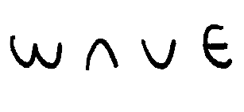

<!DOCTYPE html>
<html>
<head>
<meta charset="utf-8" />
<link href="m.icon" rel="shortcut icon" type="image/x-icon">

<title>파도</title>

    
</head>
<body onload="showImage()">
    
</body>
</html>
